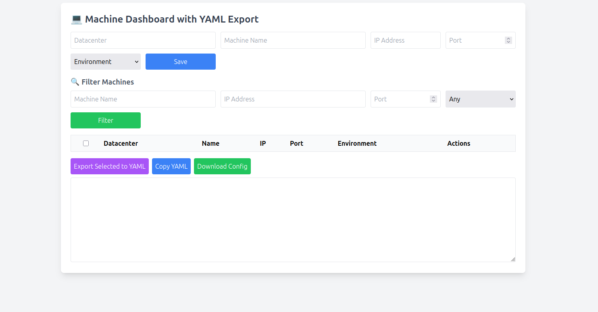

# 💻 Machine Dashboard with YAML Export

A responsive web application to manage your machines and export selected entries as YAML (SSH config style). Built with **HTML, Tailwind CSS, and Vanilla JavaScript**, storing data locally in the browser using `localStorage`.

---

## 🌟 Features

- Add, edit, and delete machines
- Filter machines by name, IP, port, or environment
- Select multiple machines and export as YAML
- Copy YAML to clipboard
- Download YAML as a `.txt` SSH configuration file
- Responsive layout with Tailwind CSS
- Client-side persistence using `localStorage`
- Easy-to-use and lightweight (no backend required)

---

## 🖼 Screenshots

 

## 🚀 Live Demo

You can try the app directly in your browser (no installation required):

[Open Demo](https://your-username.github.io/machine-dashboard-yaml-export/)  

